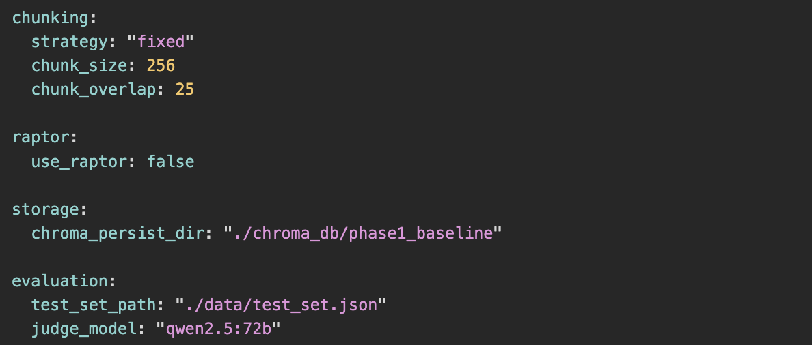

# 项目实验报告（细化版）：Phase 1 与 Phase 2A 对比

## 0. 摘要

本报告对金融研报问答系统进行了两阶段消融对比：

- **Phase 1（Baseline）**：`Fixed-256` 分块，不启用 RAPTOR。
- **Phase 2A（Advanced）**：`Semantic Chunking + RAPTOR`。

在当前 **10 题样本** 下，Phase 2A 的 `faithfulness` 小幅提升（+1.53%），但 `context_precision`（-16.61%）和 `answer_relevancy`（-8.58%）下降，导致综合均值从 0.8014 降至 0.7553。结论是：当前高级链路“更保守、更少幻觉”，但“检索对题性不稳定”，需要检索链路调参与题型分路后再做最终判断。

---

## 1. 实验目的与研究问题

本实验围绕以下问题展开：

1. 引入 `semantic` 分块与 RAPTOR 后，是否能提升问答整体质量？
2. 性能变化是否一致体现在检索、生成忠实度和问题命中度三个维度？
3. 若出现分化，主要瓶颈位于检索端还是生成端？

---

## 2. 实验设计

### 2.1 对照原则

依据 `docs/05_progress_report_guide.md`：

- 使用同一批文档、同一测试集与同一评估脚本；
- 仅改变架构变量（分块策略与 RAPTOR 开关）；
- 指标统一使用 RAGAS 三项核心分数。

### 2.2 配置对比

| 维度 | Phase 1 | Phase 2A |
| :-- | :-- | :-- |
| Chunking | `fixed` (`chunk_size=256`, `chunk_overlap=25`) | `semantic` |
| RAPTOR | `false` | `true` |
| 存储目录 | `./chroma_db/phase1_baseline` | `./chroma_db/phase2_raptor` |
| 评估脚本 | `src/evaluation/ragas_eval.py` | `src/evaluation/ragas_eval.py` |
| 输出文件 | `data/phase1_evaluation_report.csv` | `data/phase2_evaluation_report.csv` |

### 2.3 评估指标定义

参考 `docs/02_evaluation_metrics.md`：

1. **Context Precision**：检索上下文是否优先返回真正相关证据。
2. **Faithfulness**：回答是否忠于证据，是否存在幻觉。
3. **Answer Relevancy**：回答是否直接命中用户问题。

### 2.4 实验假设

- **H1（检索假设）**：`semantic + RAPTOR` 对总结/推理类问题更有利。
- **H2（忠实度假设）**：上下文结构增强后，`faithfulness` 提升。
- **H3（稳定性假设）**：若无重排优化，事实定位题可能出现召回漂移。

### 2.5 系统技术架构与调用链路

本项目采用 `LlamaIndex + Ollama + ChromaDB` 的本地闭环架构，执行路径如下：

1. **数据接入层（Ingestion）**
   - 脚本：`src/ingest/indexer.py`
   - 功能：解析 PDF、按策略分块、向量化并写入 Chroma 持久库。
   - 路由逻辑：`get_index()` 根据 `raptor.use_raptor` 自动选择单层索引或 RAPTOR 索引。

2. **检索层（Retrieval）**
   - 脚本：`src/retrieval/retriever.py`
   - Phase 1：`get_basic_retriever()`，单路 Dense Vector 检索（`similarity_top_k=final_top_k`）。
   - Phase 2A：`get_hybrid_retriever()`，向量检索 + BM25 双路召回，并通过 `QueryFusionRetriever` 的 RRF 融合。
   - 缓存优化：BM25 词频矩阵与 reranker 使用全局单例缓存，降低多轮查询冷启动开销。

3. **生成层（Generation）**
   - 脚本：`src/generation/pipeline.py`
   - 核心模板：`QA_PROMPT_TEMPLATE` 强制“仅依据上下文回答 + 信息不足时固定降级话术 + 引用格式约束”。
   - 评估阶段由 `RetrieverQueryEngine` 单轮执行，减少多轮记忆污染；交互阶段可启用 `CondensePlusContextChatEngine`。

4. **评估层（Evaluation）**
   - 脚本：`src/evaluation/ragas_eval.py`
   - 数据流：读取测试集 -> 调用检索+生成引擎产出 `answer/contexts` -> RAGAS 打分 -> 导出 CSV。
   - 结果文件按 `chunking.strategy` 自动命名，避免 Phase 覆盖。

### 2.6 关键实现差异（Phase 1 vs Phase 2A）

| 模块 | Phase 1 | Phase 2A | 代码实现位置 |
| :-- | :-- | :-- | :-- |
| 分块 | Fixed 长度分块（256/25） | `SemanticSplitterNodeParser` 自适应切分 | `src/ingest/indexer.py` |
| 索引结构 | 单层向量索引 | RAPTOR 树状摘要（`mode="collapsed"`）+ 向量索引 | `src/ingest/indexer.py` |
| 检索策略 | 单路向量召回 | Vector + BM25 双路 + RRF 融合 | `src/retrieval/retriever.py` |
| 精排 | 无显式强制精排 | `SentenceTransformerRerank`（语义模式下挂载） | `src/retrieval/retriever.py` / `src/generation/pipeline.py` |
| 生成约束 | 统一 QA Prompt | 同一模板，依赖更复杂上下文输入 | `src/generation/pipeline.py` |
| 评估方式 | RAGAS 三指标 | RAGAS 三指标 | `src/evaluation/ragas_eval.py` |

### 2.7 关键参数（本次实验实际配置）

以下参数直接影响实验结果，并应在复现实验时保持一致：

| 参数组 | 配置值 | 作用 |
| :-- | :-- | :-- |
| `llm.weak_model` | `qwen2.5:7b` | 回答生成模型（被测系统选手） |
| `llm.temperature` | `0.1`（评估流程中实际传入 `0.0`） | 降低生成随机性，提升可重复性 |
| `embedding.model` | `BAAI/bge-m3` | 向量检索与 RAGAS 相关性计算底座 |
| `reranker.model` | `BAAI/bge-reranker-base` | Phase 2A 精排模型 |
| `retrieval.vector_top_k` | `20` | 向量路初筛召回规模 |
| `retrieval.bm25_top_k` | `20` | BM25 路初筛召回规模 |
| `retrieval.final_top_k` | `5` | 最终注入 LLM 的上下文规模 |
| `chunking.semantic_breakpoint_percentile` | `95` | 语义切分阈值，影响块粒度与上下文完整性 |
| `raptor.max_levels` | `3` | 摘要树层级深度 |
| `raptor.summary_model` | `qwen2.5:7b` | 后台摘要生成模型 |
| `evaluation.judge_model` | `qwen2.5:7b`（当前配置） | RAGAS 裁判模型 |

> 注：`src/evaluation/ragas_eval.py` 中的打印文案仍写有 “72B 裁判” 的提示语，但实际实例化模型以 `configs/config.yaml` 中 `evaluation.judge_model` 为准。

---

## 3. 可复现实验流程

### 3.1 Phase 1

```bash
export PYTHONPATH=.
source .venv/bin/activate
python src/ingest/indexer.py
python src/evaluation/ragas_eval.py
```

### 3.2 Phase 2A

```bash
export PYTHONPATH=.
source .venv/bin/activate
python src/ingest/indexer.py
python src/evaluation/ragas_eval.py
```

### 3.3 结果文件

- `data/phase1_evaluation_report.csv`
- `data/phase2_evaluation_report.csv`

### 3.4 RAGAS 打分技术细节

评估脚本将每道题组织为四元组：

- `question`：用户问题
- `answer`：系统回答（由弱模型生成）
- `contexts`：检索到的 source nodes 文本列表
- `ground_truth`：测试集标准答案

然后执行：

1. `ContextPrecision(llm=ragas_llm)`：裁判模型判断“相关上下文是否靠前”；
2. `Faithfulness(llm=ragas_llm)`：裁判模型判断回答是否可由上下文推导；
3. `AnswerRelevancy(llm=ragas_llm, embeddings=ragas_emb, strictness=1)`：结合语义相似度判定问答匹配度。

为保证本地稳定性，评估脚本采用：

- `RunConfig(timeout=600, max_retries=3, max_workers=1)`；
- `batch_size=1`（避免高并发导致显存/内存抖动）；
- `raise_exceptions=False`（单题异常不阻断全流程）。

---

## 4. 截图展示位（请在提交前替换）

> 说明：以下为报告截图占位符，提交前替换为真实图片文件。当前已放置 `P1-1` 示例图。

### 4.1 S0 环境核查截图


**建议包含**：工作目录、`data/` 文件列表、配置摘要输出。

### 4.2 P1-1 Phase 1 配置截图



**建议包含**：`chunking`、`raptor`、`storage.chroma_persist_dir`、`evaluation.judge_model`。

### 4.3 P1-2 Phase 1 索引构建日志截图


### 4.4 P1-3 Phase 1 评估日志截图


### 4.5 P2-1 Phase 2A 配置截图


### 4.6 P2-2 Phase 2A 索引构建日志截图


### 4.7 P2-3 Phase 2A 性能开销截图（可选）


### 4.8 P2-4 Phase 2A 评估日志截图


---

## 5. 数据说明与统计口径

- 样本量：两份报告均为 **10 条问答样本**。
- 配对方式：按题目顺序进行逐题配对比较。
- 缺失值：Phase 1 在 `faithfulness` 有 1 条缺失；其余无缺失。
- 说明：规范建议正式报告使用 20 题标准集，当前结果用于阶段性分析。

---

## 6. 量化结果（总体对比）

### 6.1 均值对比

| 指标 | Phase 1 | Phase 2A | 变化量（P2A-P1） | 相对变化 |
| :-- | --: | --: | --: | --: |
| Context Precision | 0.6628 | 0.5527 | -0.1101 | -16.61% |
| Faithfulness | 0.9306 | 0.9448 | +0.0142 | +1.53% |
| Answer Relevancy | 0.8407 | 0.7686 | -0.0721 | -8.58% |
| 三指标综合均值 | 0.8014 | 0.7553 | -0.0461 | -5.75% |

### 6.2 分布统计（均值/中位数/标准差）

| 指标 | Phase 1（mean/median/std） | Phase 2A（mean/median/std） | 观察 |
| :-- | :-- | :-- | :-- |
| Context Precision | 0.6628 / 0.6972 / 0.3171 | 0.5527 / 0.6624 / 0.2039 | 均值下降，且高分样本减少 |
| Faithfulness | 0.9306 / 1.0000 / 0.1102 | 0.9448 / 1.0000 / 0.0994 | 小幅提升，波动略收敛 |
| Answer Relevancy | 0.8407 / 0.8651 / 0.1547 | 0.7686 / 0.8611 / 0.2794 | 均值下降，波动显著变大 |

### 6.3 阈值通过率（>=0.9 / >=0.8）

| 指标 | Phase 1 | Phase 2A | 变化 |
| :-- | :-- | :-- | :-- |
| Context Precision >= 0.9 | 4/10 | 0/10 | 显著退化 |
| Context Precision >= 0.8 | 4/10 | 0/10 | 显著退化 |
| Faithfulness >= 0.9 | 6/9 | 8/10 | 提升 |
| Faithfulness >= 0.8 | 7/9 | 9/10 | 提升 |
| Answer Relevancy >= 0.9 | 4/10 | 3/10 | 小幅下降 |
| Answer Relevancy >= 0.8 | 8/10 | 7/10 | 小幅下降 |

---

## 7. 逐题差异分析（配对）

### 7.1 改善与退化计数

- **Context Precision**：4 题提升，6 题下降。
- **Faithfulness**：3 题提升，1 题下降，5 题持平（另 1 题因 Phase 1 缺失不计）。
- **Answer Relevancy**：6 题提升，4 题下降（但含 1 条极端退化样本）。

### 7.2 代表性变化样本

| 问题 | 主要变化 | 现象 |
| :-- | :-- | :-- |
| 本次研报的核心研究问题是什么？ | `CP -0.8056`, `AR +0.2612` | 检索精度大幅下降，但回答文本相关性有提升 |
| 长期通胀预期是否明显变化？ | `CP +0.4667` | 语义检索在推理类问题上有明显收益 |
| 美国2026财政赤字变化？ | `CP -0.4653`, `FA +0.2500`, `AR -0.0990` | 回答更忠实，但检索与对题性变差 |
| 风险提示有哪些？ | `FA -0.2857`, `AR -0.9771` | 异常样本，需优先排查 |

---

## 8. 误差分析（Error Analysis）

### 8.1 异常样本 A：风险提示问题

- 现象：Phase 2A 的 `answer_relevancy` 下降至 0，`faithfulness` 同步下降。
- 可能原因：
  - 召回结果中噪声块占比高，导致回答先出现“未找到明确汇总”的防御性措辞；
  - 指令执行策略偏保守，未先给出明确的三条风险结论。
- 修复建议：
  - 强化“目录/免责声明”过滤；
  - 对“风险提示、结论、摘要”类问法增加关键词加权与重排；
  - 在生成模板中加入“先给结论，再给补充”的约束。
  - 对降级句式 `基于当前源文档暂未找到关联信息。` 增加触发条件（仅当 top-k 均低相关时触发）。

### 8.2 异常样本 B：核心研究问题

- 现象：`context_precision` 极大幅下降，回答偏“主题扩展”而非“一句话命中”。
- 可能原因：
  - RAPTOR 摘要节点覆盖广但不够“首句精准”；
  - 问题属于事实定位型，semantic 策略未体现优势。
- 修复建议：
  - 对事实题启用更强短块优先策略；
  - 在答案模板中加入“核心问题：XXX”首句规则。
  - 在混合检索结果中增加“标题/章节锚点”特征，提升对“核心问题”类问法的首条命中概率。

### 8.3 机制层面的根因分析

从实现上看，当前性能分化与以下机制相关：

1. **Phase 2A 召回空间扩大**
   - Vector/BM25 双路各自召回 20 条，融合后候选空间显著大于基线；
   - 若后续重排未对“问题意图”施加足够约束，噪声候选更易进入最终上下文。

2. **RAPTOR `collapsed` 模式的影响**
   - 高层摘要与底层叶子节点平铺检索，适合宏观归纳题；
   - 但对事实定位题可能产生“摘要语义相关但证据不精确”的情况。

3. **Prompt 降级策略与相关性评分耦合**
   - 当前模板明确要求信息不足时返回固定降级句；
   - 当检索质量边界波动时，模型更可能触发保守输出，导致 `answer_relevancy` 低分。

---

## 9. 结果讨论与有效性威胁

### 9.1 结果讨论

- Phase 2A 对“忠实度”有效，但对“检索精度”和“问题命中”不稳定。
- 当前结果支持“高级架构需配套检索调参”这一判断，而非简单否定语义分块与 RAPTOR。

### 9.2 有效性威胁（Threats to Validity）

1. **样本量偏小**：10 题对异常值敏感，均值波动大。
2. **题型分布未知**：若事实题占比高，会放大 fixed 策略优势。
3. **缺失值影响**：Phase 1 有 1 条 `faithfulness` 缺失，影响严格可比性。
4. **运行噪声**：本地推理负载、模型状态与检索缓存可能引入波动。

---

## 10. 下一步计划（按优先级）

### P0（必须先做）

1. 按规范补齐 **20 题标准测试集** 后重跑两阶段实验。
2. 为 Phase 2A 增加检索重排调参（top-k、rerank 权重、噪声过滤）。
3. 对异常问题建立“逐题对照卡”（问题-检索片段-回答-指标）。

### P1（建议）

1. 增加题型分路策略：事实题优先短块、总结题走 RAPTOR。
2. 增加回答模板约束，减少“先否定再给答案”的输出模式。
3. 补充“引用页码命中率/伪造引用拦截率”产品可用性指标。

### P2（可选增强）

1. 记录索引耗时、磁盘占用、CPU/内存峰值，形成 trade-off 图表。
2. 做一次多文档场景复现实验，验证结论外推能力。

---

## 11. 最终结论

在当前 10 题阶段性实验下：

- **Phase 2A 在降低幻觉方面有正向收益**（`faithfulness` 提升）；
- **但检索精度与问题命中存在退化**（`context_precision`、`answer_relevancy` 下降）；
- **综合表现仍低于 Phase 1**，暂不建议直接替换基线。

建议以“检索优化 + 题型分路 + 20题复现实验”作为下一迭代主线，再评估 Phase 2A 的最终可用性。

---

## 12. 截图索引表（提交前核对）

| 截图编号 | 对应位置 | 是否必需 | 建议文件名 |
| :-- | :-- | :-- | :-- |
| S0 | 环境准备与核查 | 必需 | `S0_env_check.png` |
| P1-1 | Phase 1 配置 | 必需 | `P1-1_phase1_config.png` |
| P1-2 | Phase 1 索引日志 | 必需 | `P1-2_phase1_index_log.png` |
| P1-3 | Phase 1 评估日志 | 必需 | `P1-3_phase1_eval_log.png` |
| P2-1 | Phase 2A 配置 | 必需 | `P2-1_phase2a_config.png` |
| P2-2 | Phase 2A 索引日志 | 必需 | `P2-2_phase2a_index_log.png` |
| P2-3 | Phase 2A 性能开销 | 可选（建议） | `P2-3_phase2a_perf.png` |
| P2-4 | Phase 2A 评估日志 | 必需 | `P2-4_phase2a_eval_log.png` |

